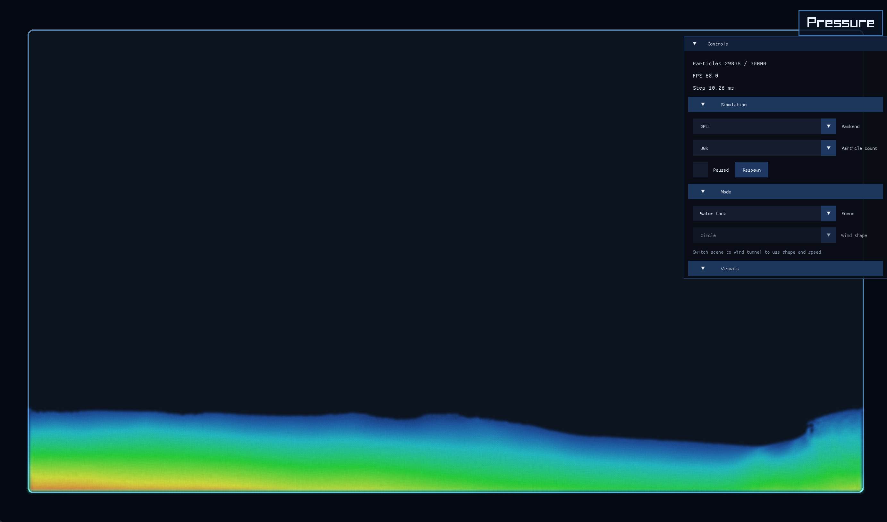

# FluidSim

2D smoothed-particle hydrodynamics demo in C with Raylib.

The solver uses:

- Weakly compressible SPH in 2D
- Uniform-grid spatial hashing for near-linear neighbor lookup
- Poly6 density kernel, spiky pressure gradient, and viscosity Laplacian with 2D normalization
- Tait-style pressure equation of state
- Thermal diffusion plus buoyancy so the same particles can look more liquid-like or gas-like under different global conditions

## Build

```bash
make
```

## Run

```bash
make run
```

## Screenshots
```md




```

## Controls

- `V`: toggle particle view / smoothing-radius field
- `C`: cycle color mode
- `G`: toggle simulation backend (`CPU` / `GPU`)
- `F`: toggle scene (`Tank` / `Wind tunnel`)
- `O`: cycle wind-tunnel obstacle (`Circle` / `Airfoil` / `Car`)
- `M`: toggle water-like / gas-like mode
- `1`: water-like preset
- `2`: gas-like preset
- `4` / `5` / `6` / `7` / `8`: target particle count presets
  CPU mode uses 10k to 50k, GPU mode uses 30k to 250k
- `[` / `]`: decrease / increase viscosity
- `-` / `=`: decrease / increase gravity
- Hold touchpad click / left mouse: apply outward pressure force
- `Space`: pause
- `R`: reset current preset

In `Wind tunnel` scene, the sim uses the gas solver, fills the channel around a switchable obstacle, and wraps left-to-right so you can watch the wake and pressure response continuously.

## Notes

This is a real SPH-style fluid solver, but it is still a classroom-scale weakly compressible approximation rather than a research-grade incompressible CFD package. The main performance gain comes from the uniform grid, which keeps neighbor queries local instead of comparing every particle against every other particle.

The current defaults are tuned for substantially higher particle counts than the first version, with contiguous cell spans replacing the older linked-list grid for better cache behavior.

On macOS, the `GPU` backend uses Metal compute for the heavy simulation passes while keeping the existing CPU-side diagnostics and Raylib rendering path.
